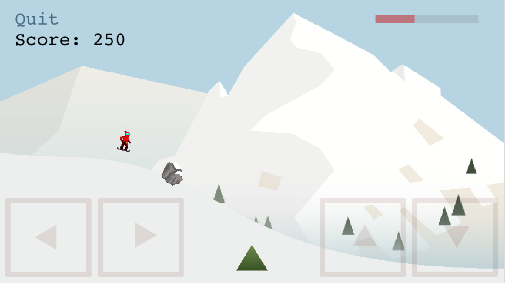
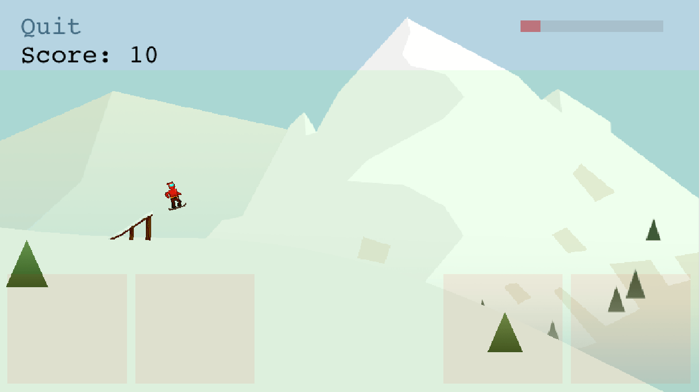

<figure>
	
</figure>

# Overiew
---
So when building my [Phaser 3](https://phaser.io/phaser3) snowboarding game for university, I decided at the last minute to add mobile support. All I had to add was the controls, as I fixed the scaling of the game UI enough that it rendered ok on mobile. Touch events for buttons on the menu and in-game worked fine, but there was no way to use WASD or arrow keys on mobile so I needed to make something custom for mobile devices! 📱


# Goals
---
- Controls only display and only work on touch devices
- Change as little of the current game logic as possible


# Method
---

#### 0. Initial setup
So firstly you should already have your keyboard layout for desktops defined in your scene `create` method like so:

```js
this.cursors = this.input.keyboard.addKeys('W,A,S,D')
// or
this.cursors = this.input.keyboard.createCursorKeys()
```

Then in your `update` method for the scene you would check the actions for the keycodes you are listening to like so:

```js
const c = this.cursors
if (c.left.isDown) {
	player.moveLeft()
} else if (c.right.isDown) {
	player.moveRight()
} else if (c.up.isDown) {
	// do something
} else if (c.down.isDown) {
	// do something
}
```

#### 1. Check if mobile

So in your scene `create` method where you define your keycodes, add an if-else statement around it. Building the mobile controls if the device is a touch device, otherwise stick to the original keyboard controls you had.

```js
if (!this.sys.game.device.input.touch) {
	this.cursors = this.input.keyboard.createCursorKeys()
} else {
	this.buildMobileControls()
}
```

#### 2. Build mobile controls

`this.buildMobileControls` isn't actually implemented, so we need to do that! Basically what we want this function to do is to listen to touch events and mutate `this.cursors` much in the same way keyboard events would. Therefore we need to create `this.cursors` to have the same structure as the desktop version - _"an object containing Key objects mapped to the input properties"_.

Since for my game I was only using the `isDown` property of the keycodes I simply mimicked this, and chose to ignore the rest of the properties.

```js
buildMobileControls() {
	// Found this helps with multiple buttons being pressed at the same time on mobile
	this.input.addPointer(2)

	// Only emitting events from the top-most Game Objects in the Display List.
	// Mainly useful if you have "background" button zones and you only want 
	// one to be triggered on a single tap.
	this.input.topOnly = true
	
	// Create an object mimicking what the keyboard version would be.
	// We are going to modify this on touch events so we can check in our update() loop
	this.cursors = {
		'up': {},
		'left': {},
		'right': {},
		'down': {},
	}
	
	// keyboard listeners to be user for each key
	const pointerDown = key => {
		// modifies this.cursors with the property that we check in update() method
		this.cursors[key].isDown = true
	}
	const pointerUp = key => {
		this.cursors[key].isDown = false
	}
	
	// button sizing
	const WIDTH = 167
	const HEIGHT = 153

	// gutter width between buttons
	const GUTTER = 12
	

	// Create a button helper
	const createBtn = (key, x, y, width=WIDTH, height=HEIGHT) => {
		// Add a faded out red rectangle for our button
		this.add.rectangle(x, y, width, height, 0xff0000, 0.07)
			.setOrigin(0,0)
			.setScrollFactor(0)
			.setInteractive()
			.on('pointerdown', () => pointerDown(key))
			.on('pointerup', () => pointerUp(key))
	}
	
	// Y coordinate to place buttons
	const BTN_Y = GAME_HEIGHT - HEIGHT - GUTTER

	// create player control buttons
	createBtn('left', GUTTER, BTN_Y)
	createBtn('right', WIDTH + 2*GUTTER, BTN_Y)
	createBtn('up', GAME_WIDTH - 2*(WIDTH + GUTTER), BTN_Y)
	createBtn('down', GAME_WIDTH - WIDTH - GUTTER, BTN_Y)
}
```

By now the controls should looks something like this:

<figure>
	
</figure>


Note that if you need the x and y coordinates of where abouts the user touched, the `pointerup` and `pointerdown` events pass the parameters `pointer, localX, localY, event` to the callback function. If you need world coordinates of the touch event use `pointer.worldX` and `pointer.worldY`. I used this for the green zone surrounding the red boxes in the screenshot above to place ramps at the x coordinate where the user touched.


#### 3. Pretty controls

We can change these rectangles to something that makes a little more sense - such as arrow key pictures:

<figure>
	
</figure>

To do this simply change the `createBtn` helper to instead of calling `this.add.rectangle`, call `this.add.image` and adjust the origin, alpha, etc. accordingly using `setOrigin`, `setAlpha`, etc.


#### 4. Improvements

How can we make this better? Well you could change the opacity on `pointerdown` to make it slightly darker so visually it's clear they are pressing it. Maybe even make the controls even default to even fainter so it's more minimalistic.

There's also a small bug with the approach above where you hold down a button and slide your finger off of it, it never fires the `pointerup` event for the button - meaning the key is "stuck" on. You could fix this by adding listeners to `pointerover` and `pointerout` events.


# Done!
---

So that's it really, doesn't take much to add some simple touch controls to your Phaser 3 game 🐯. Just a little bit of knowledge of how the Phaser KeyboardPlugin works and drawing some simple interactice shapes. Maybe in the future there will be an easier or standard way to do this in Phaser, but in the meantime this worked beautifully for me without changing too much existing code.


